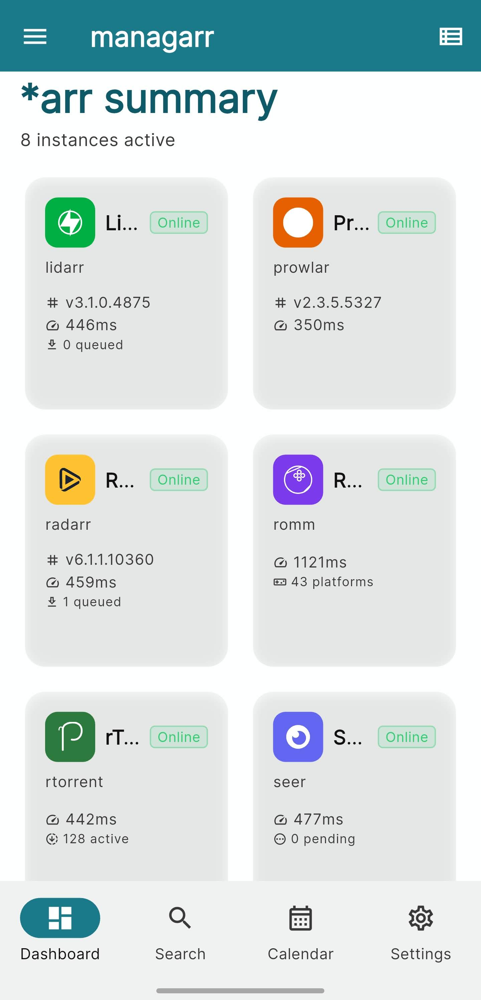
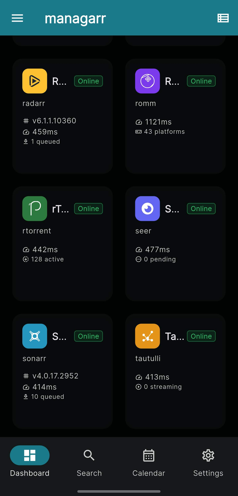
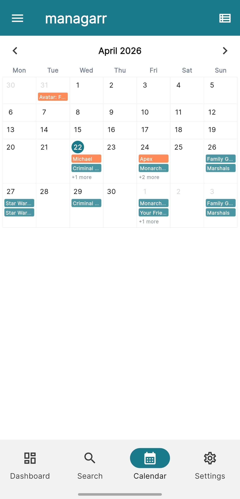
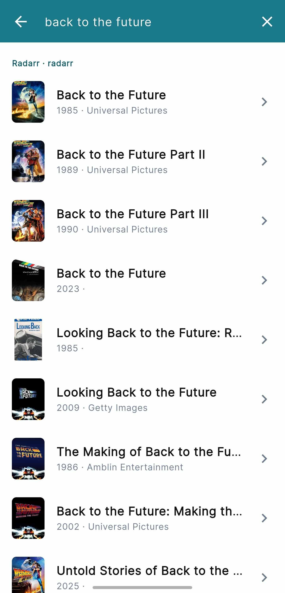
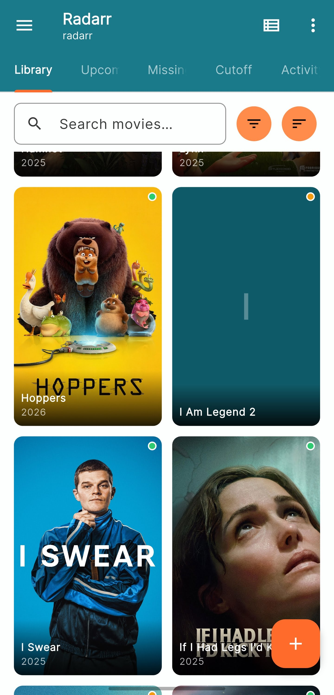
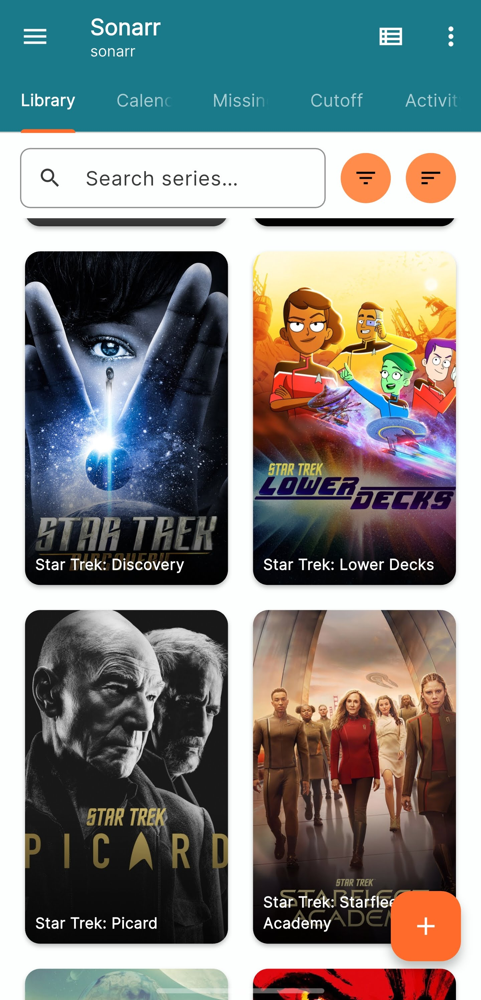
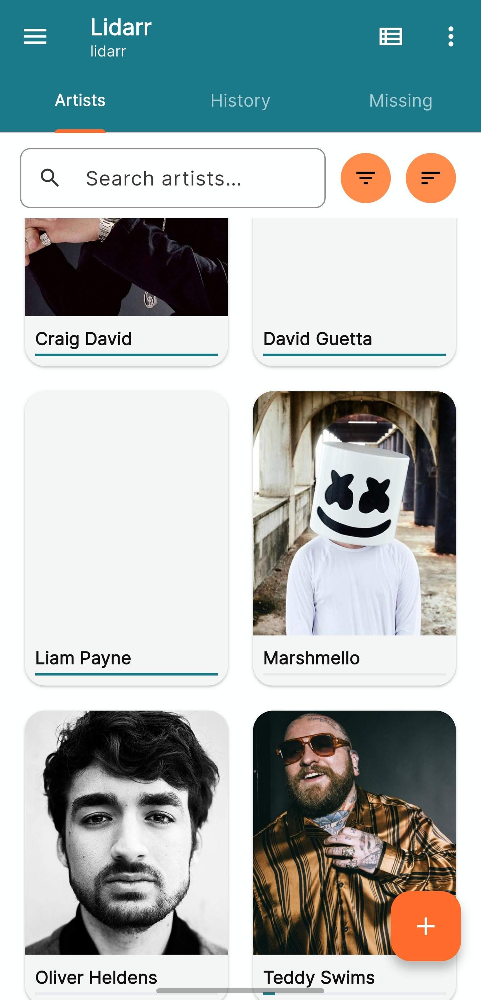
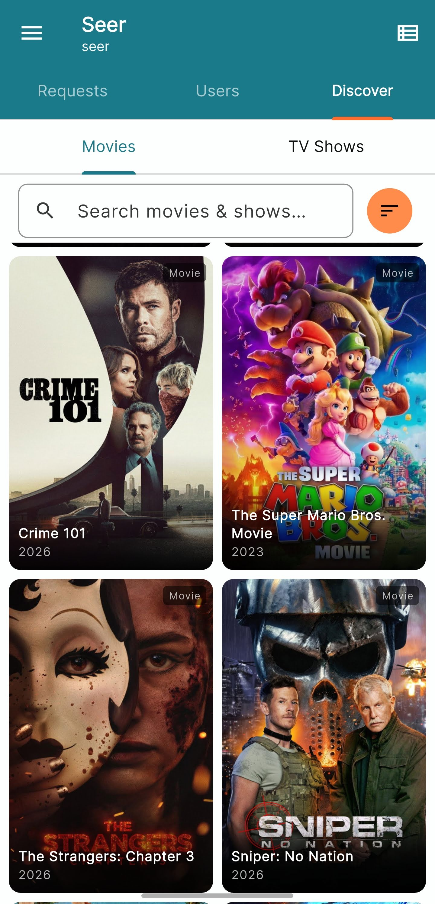
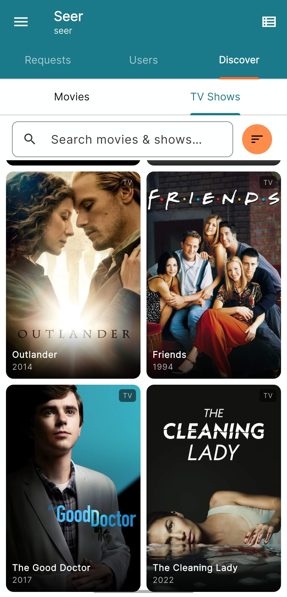
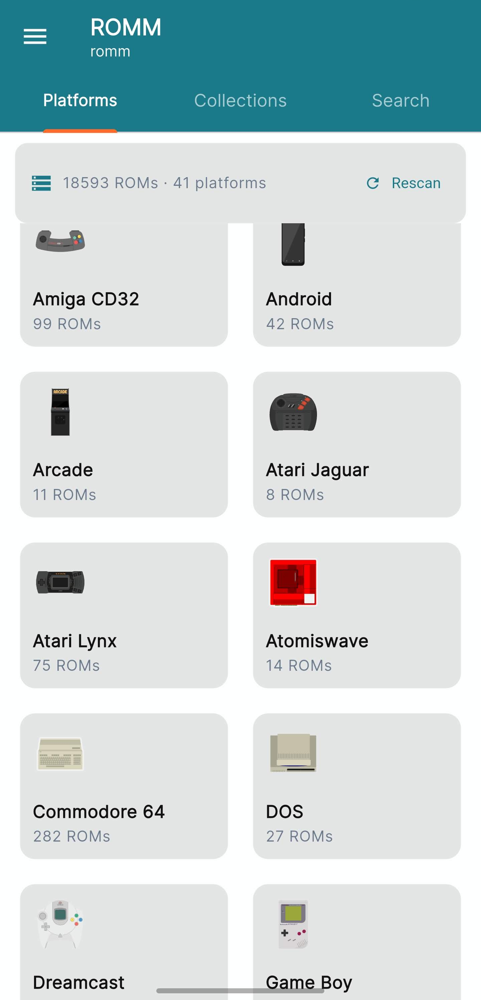

&nbsp;

# managarr

A Flutter mobile client for managing your self-hosted media automation stack. Connect to Radarr, Sonarr, Lidarr, Prowlarr, Overseerr/Jellyseerr, SABnzbd, NZBGet, rTorrent, Tautulli, and ROMM from a single app.

## Features

### Services
| Service | Capabilities |
|---|---|
| **Radarr** | Browse library, movie details, search & add movies, interactive release search, grab releases, queue |
| **Sonarr** | Browse library, series & season details, episode search, interactive release search, grab releases, queue |
| **Lidarr** | Browse music library, artist & album details |
| **Prowlarr** | Indexer status and management |
| **Overseerr / Jellyseerr** | Browse and manage media requests |
| **SABnzbd** | Download queue, history, speed monitoring |
| **NZBGet** | Download queue, history, status |
| **rTorrent** | Torrent list, status, speed monitoring |
| **Tautulli** | Plex activity, history, libraries, users, statistics, logs |
| **ROMM** | Browse ROM library by platform, search ROMs, view game metadata, download ROMs to device |

### App-wide
- **Unified Calendar** — month and list view of upcoming movies and episodes across all Radarr and Sonarr instances; Downloaded/quality and Unaired status badges
- **Global Search** — search movies and series across all Radarr and Sonarr instances simultaneously; tap to open detail or add screen
- **Dashboard** — at-a-glance status cards for every connected service
- **Android home-screen widget** — upcoming calendar entries on your home screen
- **Multiple instances** — add as many instances of each service as you need
- **Light / Dark / System theme**

### Settings
- Add, edit, and delete service instances
- Backup all instance configuration to a JSON file
- Restore from backup (merge or replace)

## Screenshots

<p>
  
  
  
  
</p>
<p>
  
  
  
</p>
<p>
  
  
  
</p>

## Getting Started

### Requirements
- Android 5.0+ (API 21)
- Self-hosted instances of any supported services

### Installation
Download the latest APK from the [Releases](../../releases) page and install it on your device.
You may need to enable **Install from unknown sources** in your Android settings.

### Building from source

1. Install [Flutter](https://docs.flutter.dev/get-started/install) (SDK ^3.11.0)
2. Clone the repository:
   ```bash
   git clone https://github.com/er0l/managarr.git
   cd managarr
   ```
3. Install dependencies:
   ```bash
   flutter pub get
   ```
4. Run on a connected device or emulator:
   ```bash
   flutter run
   ```
5. Build a release APK:
   ```bash
   flutter build apk --release
   ```

## Configuration

Open the app and go to **Settings → +** to add your first service instance. Each instance requires:
- **Name** — a label for this instance (e.g. "Home Radarr")
- **Base URL** — the full URL including port (e.g. `http://192.168.1.10:7878`)
- **API Key** — found in the service's web UI under Settings → General

> **ROMM** uses a username and password instead of an API key. Enter your ROMM credentials in the Username and Password fields when adding a ROMM instance.

Multiple instances of the same service are supported (e.g. two Sonarr instances for different libraries).

To back up your configuration go to **Settings → ⋮ → Backup**. To restore, use **Settings → ⋮ → Restore**.

## Project Structure

```
lib/
├── core/
│   ├── database/       # Drift SQLite database and table definitions
│   ├── router/         # GoRouter navigation and shell scaffold
│   ├── theme/          # App colours and theme configuration
│   └── widgets/        # Shared widgets (AppDrawer, etc.)
└── features/
    ├── calendar/        # Unified calendar across Radarr + Sonarr
    ├── dashboard/       # Service status overview
    ├── lidarr/          # Lidarr integration
    ├── nzbget/          # NZBGet integration
    ├── prowlarr/        # Prowlarr integration
    ├── radarr/          # Radarr integration
    ├── rtorrent/        # rTorrent integration
    ├── sabnzbd/         # SABnzbd integration
    ├── search/          # Global search screen
    ├── seer/            # Overseerr / Jellyseerr integration
    ├── settings/        # Instance management, backup/restore, theme
    ├── sonarr/          # Sonarr integration
    ├── tautulli/        # Tautulli integration
    ├── romm/            # ROMM integration
    └── widget/          # Android home-screen widget update service
```

## Tech Stack

- **Flutter** + **Dart** (SDK ^3.11.0)
- **Riverpod 2** — state management
- **GoRouter** — navigation
- **Drift** — local SQLite database
- **Dio** — HTTP client
- **fl_chart** — charts and graphs
- **file_picker** — backup/restore file access
- **home_widget** — Android home-screen widget

## Contributing

Pull requests are welcome. Please run `flutter analyze` before submitting — the project enforces zero warnings.

## License

MIT
